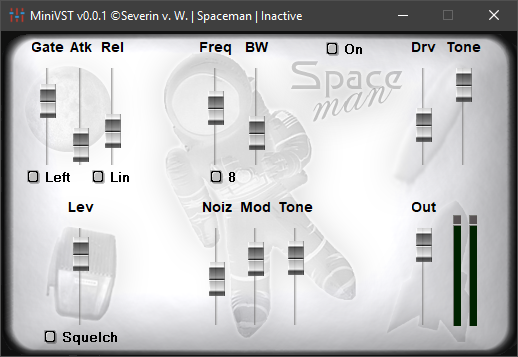

# MiniVST [](https://ci.appveyor.com/project/medusalix/MiniVST) [](https://github.com/medusalix/MiniVST/releases/latest)



*(Credits: [Spaceman](https://www.kvraudio.com/product/spaceman_by_mb_plugins) by MB-PlugIns)*

---


MiniVST is a ***minimalistic Windows-only VST2 Host***.

It uses the [**Steinberg VST SDK**](https://www.steinberg.net/en/company/developer.html) and [**Windows Audio Session API (WASAPI)**](https://msdn.microsoft.com/en-us/library/windows/desktop/dd371455(v=vs.85).aspx) to achieve *minimum-latency real-time* sound effects. 
Many different plugins are supported.

## Features

- **User Interface** showing the plugins' editor
- **Real-time** audio transformation
- **Hotkey** to enable and disable the effect
- **Plugin settings** are saved automatically
- **Simple config file** to change settings
- **Single executable** for ease of use

## Usage

MiniVST needs to be configured through [**``MiniVST.cfg``**](MiniVST/MiniVST.cfg) before first launch.
The attached config file includes examples and descriptions for all options.
To ensure successful operation you have to adjust the following settings:

1. ``input_device`` and ``output_device`` need to correspond to your desired audio devices.
2. ``plugin_path`` must point to the DLL file of the VST effect.
3. ``hotkey`` has to be set to enable/disable the sound processing.

## Building

- Copy neccessary files into [``include``](MiniVST/include) folder
- Open the project with Visual Studio 2017
- Build application in ``Debug`` or ``Release`` mode
- *Note:* Currently only x86 configurations are supported

## License

MiniVST is released under the [Apache 2.0 license](LICENSE).

```
Copyright (C) 2018 Medusalix

Licensed under the Apache License, Version 2.0 (the "License");
you may not use this file except in compliance with the License.
You may obtain a copy of the License at

    http://www.apache.org/licenses/LICENSE-2.0

Unless required by applicable law or agreed to in writing, software
distributed under the License is distributed on an "AS IS" BASIS,
WITHOUT WARRANTIES OR CONDITIONS OF ANY KIND, either express or implied.
See the License for the specific language governing permissions and
limitations under the License.
```

*``VST is a trademark of Steinberg Media Technologies GmbH``*
